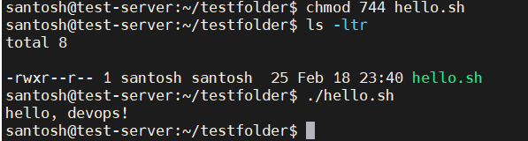
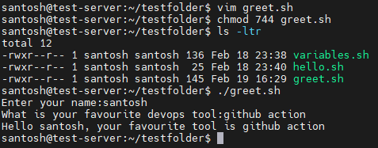
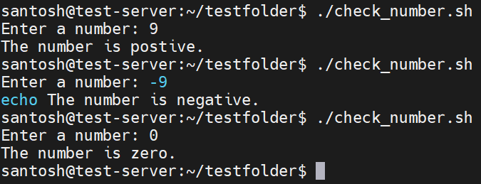
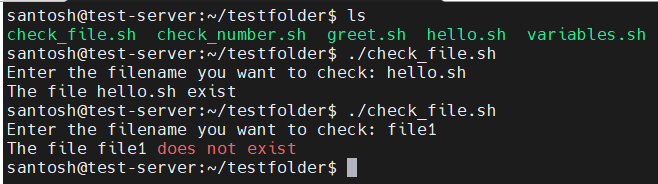
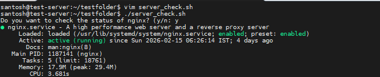

# Shell Scripting 
### Task 1: Your First Script
1. Create a file `hello.sh`
- touch hello.sh
2. Add the shebang line `#!/bin/bash` at the top
3. Print `Hello, DevOps!` using `echo`
4. Make it executable and run it
- chmod 744 hello.sh

[Script](Scripts/hello.sh)

**Document:** What happens if you remove the shebang line?
- Removing the shebang (#!) from a bash script means that when the file is run as as executable e.g. using ./hello.sh the operating system kernel cannot determine the intended interpreter 

---

### Task 2: Variables
1. Create `variables.sh` with:
   - A variable for your `NAME`
   - A variable for your `ROLE` (e.g., "DevOps Engineer")
   - Print: `Hello, I am <NAME> and I am a <ROLE>`
2. Try using single quotes vs double quotes — what's the difference?
- double quotes " " its called variable, what u define use $ sign when u want to use a variable 
- single qutes ' ' it will print as it is written words 

[Script](Scripts/variables.sh)

---

### Task 3: User Input with read
1. Create `greet.sh` that:
   - Asks the user for their name using `read`
   - Asks for their favourite tool
   - Prints: `Hello <name>, your favourite tool is <tool>`

[Script](Scripts/greet.sh)

---

### Task 4: If-Else Conditions
1. Create `check_number.sh` that:
   - Takes a number using `read`
   - Prints whether it is **positive**, **negative**, or **zero**

   [Script](Scripts/check_number.sh)

   

2. Create `file_check.sh` that:
   - Asks for a filename
   - Checks if the file **exists** using `-f`
   - Prints appropriate message

   [Script](Scripts/check_file.sh)

   

   ---

   ### Task 5: Combine It All
Create `server_check.sh` that:
1. Stores a service name in a variable (e.g., `nginx`, `sshd`)
2. Asks the user: "Do you want to check the status? (y/n)"
3. If `y` — runs `systemctl status <service>` and prints whether it's **active** or **not**
4. If `n` — prints "Skipped."

[Script](Scripts/server_check.sh)

