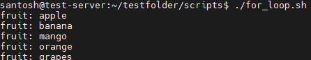
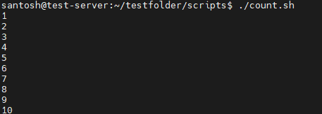
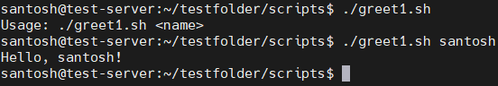
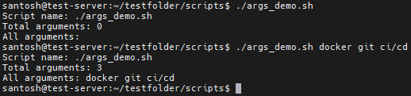
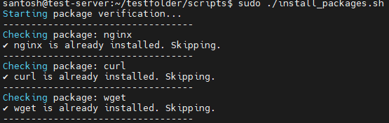
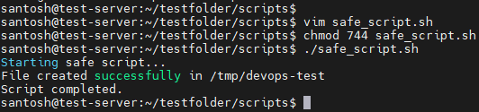

## Challenge Tasks

### Task 1: For Loop
1. Create `for_loop.sh` that:
   - Loops through a list of 5 fruits and prints each one
2. Create `count.sh` that:
   - Prints numbers 1 to 10 using a for loop

 [Script](Scripts/for_loop.sh)  

 


 [Script](Scripts/count.sh)  

 

 ---
 ### Task 2: While Loop
1. Create `countdown.sh` that:
   - Takes a number from the user
   - Counts down to 0 using a while loop
   - Prints "Done!" at the end


[Script](Scripts/countdown.sh)  


---

### Task 3: Command-Line Arguments
1. Create `greet.sh` that:
   - Accepts a name as `$1`
   - Prints `Hello, <name>!`
   - If no argument is passed, prints "Usage: ./greet.sh <name>"


[Script](Scripts/greet1.sh)  




2. Create `args_demo.sh` that:
   - Prints total number of arguments (`$#`)
   - Prints all arguments (`$@`)
   - Prints the script name (`$0`)


[Script](Scripts/args_demo.sh) 





---

### Task 4: Install Packages via Script
1. Create `install_packages.sh` that:
   - Defines a list of packages: `nginx`, `curl`, `wget`
   - Loops through the list
   - Checks if each package is installed (use `dpkg -s` or `rpm -q`)
   - Installs it if missing, skips if already present
   - Prints status for each package

> Run as root: `sudo -i` or `sudo su`

[Script](Scripts/install_packages.sh) 





---

### Task 5: Error Handling
1. Create `safe_script.sh` that:
   - Uses `set -e` at the top (exit on error)
   - Tries to create a directory `/tmp/devops-test`
   - Tries to navigate into it
   - Creates a file inside
   - Uses `||` operator to print an error if any step fails

Example:
```bash
mkdir /tmp/devops-test || echo "Directory already exists"
```

2. Modify your `install_packages.sh` to check if the script is being run as root — exit with a message if not.


[Script](Scripts/safe_script.sh) 



