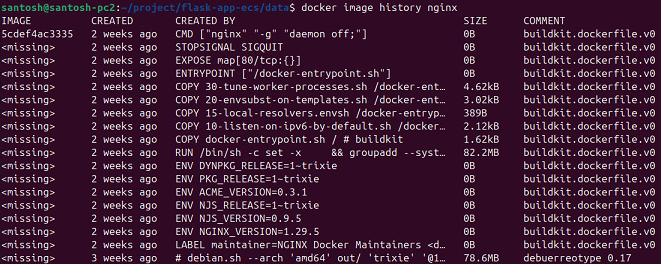
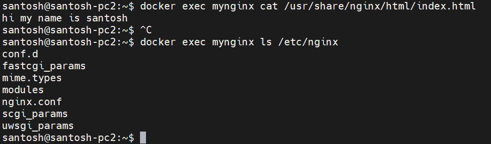
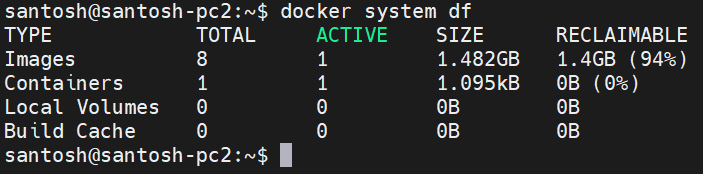

# Day 30 – Docker Images & Container Lifecycle
## Task 1: Docker Images
### 1. Pull the `nginx`, `ubuntu`, and `alpine` images from Docker Hub
- docker pull nginx 
- docker pull ubuntu
- docker pull alpine

### 2. List all images on your machine — note the sizes
- docker images

### 3. Compare `ubuntu` vs `alpine` — why is one much smaller?
- ubuntu 78.1 MB and alpiine 8.44 MB
- Alpine Docker images are much smaller than Ubuntu mainly because they’re built with minimal components and different core libraries  
- Alpine is designed to include only what’s necessary to run Linux.
  No extra utilities
  No full GNU toolchain
  No unnecessary services

Ubuntu includes many default packages for general-purpose usage  

- Interview-ready one-liner

Alpine is smaller because it uses BusyBox, musl libc, and a minimal base system with no extra packages, unlike Ubuntu which includes a full GNU userland and glibc

### 4. Inspect an image — what information can you see?
- docker image inspect <image_name_or_id>
- This returns detailed JSON output including:

    Image ID

    Tags

    Created date

    Architecture

    OS

    Layers

    Environment variables

    Entrypoint / CMD

    Exposed ports

    Labels

### 5. Remove an image you no longer need
- docker images prun   --->Remove dangling images (untagged images) 
- docker images prun -a   --->Remove all unused images (not just dangling ones)
---

## Task 2: Image Layers
### 1. Run `docker image history nginx` — what do you see?
 - docker history nginx shows the layer-by-layer build history of the nginx image.
   It displays each layer’s size, creation time, and the Dockerfile command used to create it.

### 2. Each line is a **layer**. Note how some layers show sizes and some show 0B
- Each line in docker history nginx represents a read-only image layer created by a         Dockerfile   instruction.

    Layers with a size (e.g., 23MB) added filesystem changes (like RUN apt-get install).
    Layers showing 0B usually come from metadata instructions such as ENV, CMD, EXPOSE, or LABEL, which don’t add files to the image

### 3. Write in your notes: What are layers and why does Docker use them?
- What are layers?
    Docker images are built as a stack of read-only layers, where each layer represents a Dockerfile instruction (e.g., RUN, COPY, ENV). When a container runs, Docker adds a thin writable layer on top.

    Why does Docker use layers?

    Reusability: Common layers are shared between images.

    Caching: Speeds up builds by reusing unchanged layers.

    Efficiency: Saves disk space and speeds up image pulls (only new layers are downloaded).

    Versioning: Makes images immutable and easier to manage

---

### Task 3: Container Lifecycle
Practice the full lifecycle on one container:
### 1. **Create** a container (without starting it)
- docker create --name mynginx -p 8080:80 nginx

### 2. **Start** the container
-  docker start mynginx 

### 3. **Pause** it and check status
 -  docker pause mynginx
    docker ps
    

### 4. **Unpause** it
 - docker unpause mynginx

### 5. **Stop** it
 -  docker stop mynginx

### 6. **Restart** it
 - docker restart myninx 

### 7. **Kill** it
 - docker kill myninx  ---> Kill it (force stop immediately)

### 8. **Remove** it
 - docker remove myninx or docker rm mynginx    ---> stopped images deleted 
    

Check `docker ps -a` after each step — observe the state changes.
 - all stopped,exited,Paused, and killed containers will show.

---

### Task 4: Working with Running Containers
### 1. Run an Nginx container in detached mode
 - docker run -d --name mynginx -p 8080:80 nginx

### 2. View its **logs**
 - docker logs myninx 

### 3. View **real-time logs** (follow mode)
 - docker logs -f myninx (follow mode)

### 4. **Exec** into the container and look around the filesystem
 -  filesystems are overlay and tmpfs

### 5. Run a single command inside the container without entering it

### 6. **Inspect** the container — find its IP address, port mappings, and mounts
 - docker inspect mynginx - complete details 
 - docker port mynginx  - get container port and host bind port
 - docker inspect -f '{{.NetworkSettings.Ports}}' mynginx 
 - docker inspect -f '{{.Mounts}}' mynginx
 - docker inspect -f '{{range .NetworkSettings.Networks}}{{.IPAddress}}{{end}}' mynginx

---

### Task 5: Cleanup

### 1. Stop all running containers in one command
 - docker stop $(docker ps -q)

### 2. Remove all stopped containers in one command
 - docker container prune

### 3. Remove unused images

 - docker image prune

### 4. Check how much disk space Docker is using
 - docker system df

 
