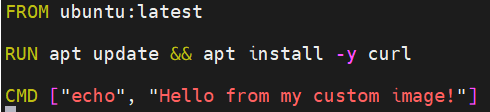
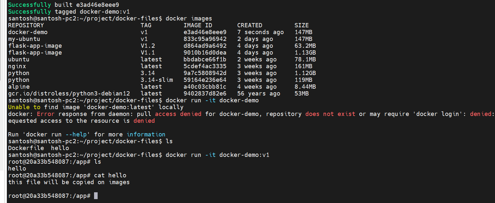
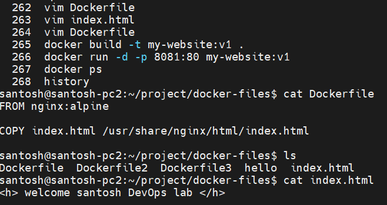

# Day 31 – Dockerfile: Build Your Own Images

## Challenge Tasks

### Task 1: Your First Dockerfile
### 1. Create a folder called `my-first-image`

- docker build -t my-ubuntu:v1 .
- docker run my-ubuntu:v1

2. Inside it, create a `Dockerfile` that:
   - Uses `ubuntu` as the base image
   - Installs `curl`
   - Sets a default command to print `"Hello from my custom image!"`
3. Build the image and tag it `my-ubuntu:v1`
4. Run a container from your image

**Verify:** The message prints on `docker run`
 - santosh@santosh-pc2:~/project/my-first-image$ docker run my-ubuntu:v1
 - Hello from my custom image!
 - santosh@santosh-pc2:~/project/my-first-image$

---

### Task 2: Dockerfile Instructions
Create a new Dockerfile that uses **all** of these instructions:
- `FROM` — base image
- `RUN` — execute commands during build
- `COPY` — copy files from host to image
- `WORKDIR` — set working directory
- `EXPOSE` — document the port
- `CMD` — default command

Build and run it. Understand what each line does.
dco
- mkdir dockerfile-demo
- cd dockerfile-demo
- touch hello.txt
- vim Dockerfile

 [Dockerfile](Dockerfile/Dockerfile)

 

---

### Task 3: CMD vs ENTRYPOINT
1. Create an image with `CMD ["echo", "hello"]` — run it, then run it with a custom command. What happens?
 - FROM ubuntu
 - ENTRYPOINT ["echo"]
2. Create an image with `ENTRYPOINT ["echo"]` — run it, then run it with additional arguments. What happens?
 - docker build -t entry-test .
3. Write in your notes: When would you use CMD vs ENTRYPOINT?
 - Default command that user can override	  CMD
 - Force container to behave like executable	ENTRYPOINT

---

### Task 4: Build a Simple Web App Image
1. Create a small static HTML file (`index.html`) with any content
2. Write a Dockerfile that:
   - Uses `nginx:alpine` as base
   - Copies your `index.html` to the Nginx web directory
3. Build and tag it `my-website:v1`
4. Run it with port mapping and access it in your browser
 
Output  
 

---

### Task 5: .dockerignore
1. Create a `.dockerignore` file in one of your project folders
 - vim .dockerignore
2. Add entries for: `node_modules`, `.git`, `*.md`, `.env`
 - .git
 - *.md
 - .env
3. Build the image — verify that ignored files are not included
 - docker build -t ignore-test .

 Why?

Docker sends build context to daemon.
Ignoring unnecessary files:

Speeds build

Reduces image size

Improves security

---

### Task 6: Build Optimization
1. Build an image, then change one line and rebuild — notice how Docker uses **cache**
- docker build -t cache-test:v1 .
2. Reorder your Dockerfile so that frequently changing lines come **last**
- try to rebuild
3. Write in your notes: Why does layer order matter for build speed?

 - Docker builds top to bottom
 - Each instruction = new layer
 - If one layer changes → all below rebuild
 - Frequently changing lines → keep at bottom
 - Dependencies first, app code later
---