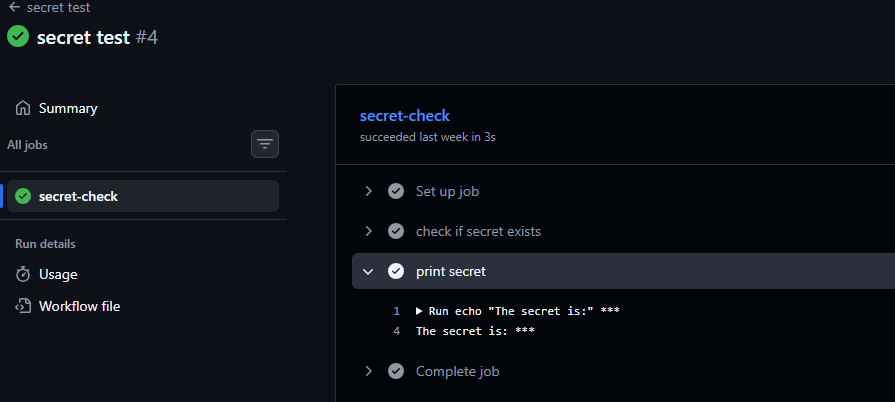
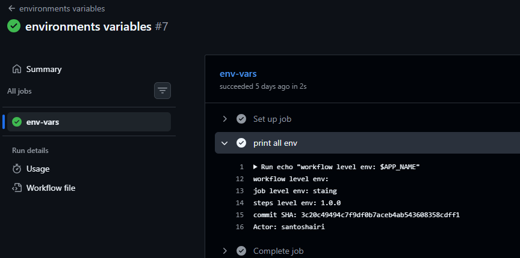
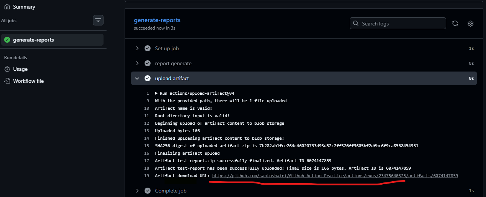
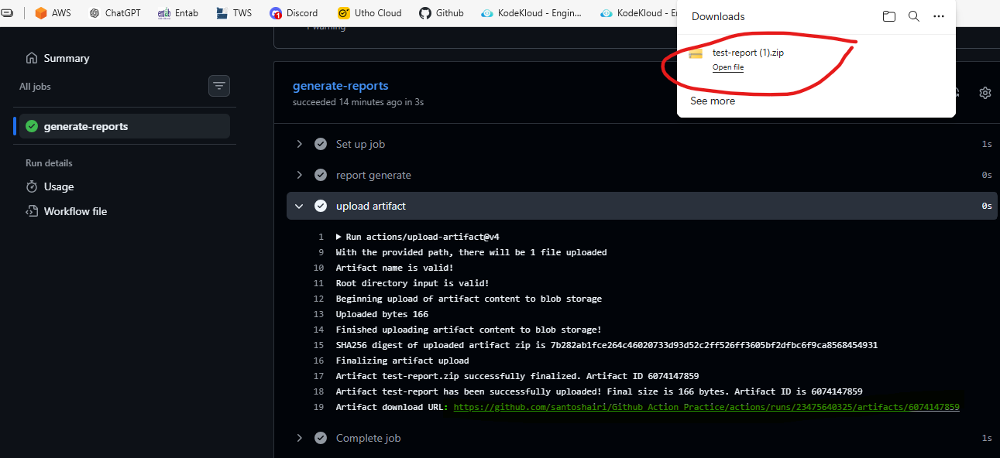
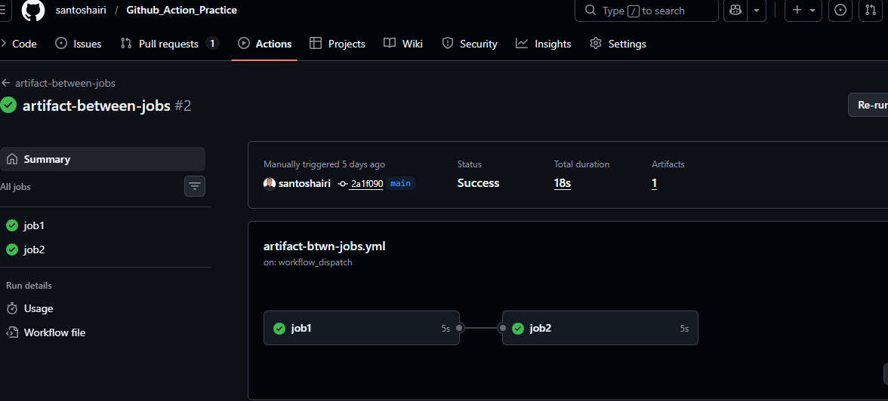
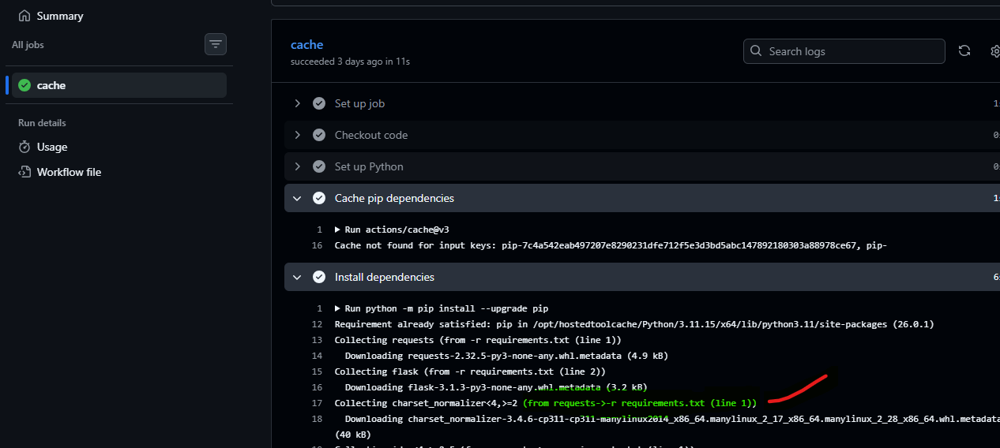

## Challenge Tasks

### Task 1: GitHub Secrets
1. Go to your repo → Settings → Secrets and Variables → Actions
2. Create a secret called `MY_SECRET_MESSAGE`
3. Create a workflow that reads it and prints: `The secret is set: true` (never print the actual value)
4. Try to print `${{ secrets.MY_SECRET_MESSAGE }}` directly — what does GitHub show?

## Write in your notes: Why should you never print secrets in CI logs?

Printing secrets (like API keys, passwords, tokens, or private keys) in CI/CD logs is a serious security risk and should always be avoided. Here’s why:

Logs Are Often Public or Widely Accessible
CI logs may be visible to team members, external collaborators, or even publicly accessible in open-source projects. Exposing secrets here means anyone with access to logs can misuse them.
Secrets Can Be Stored Permanently
Logs are usually stored for debugging and auditing purposes. If a secret is printed once, it may remain in log history indefinitely, increasing the risk of compromise.
Easy Target for Attackers
Attackers often scan logs to find exposed credentials. A leaked token can allow unauthorized access to systems, cloud resources, or repositories.
Privilege Escalation Risk
If the exposed secret has high privileges (e.g., admin access in AWS, Kubernetes, or databases), it can lead to full system compromise.
Compliance and Security Violations
Printing secrets may violate security policies, industry standards (like ISO, SOC2), or company compliance requirements.

Best Pr

## [wokrflows](workflows/secrets.yml)

---

### Task 2: Use Secrets as Environment Variables
1. Pass a secret to a step as an environment variable
2. Use it in a shell command without ever hardcoding it
3. Add `DOCKER_USERNAME` and `DOCKER_TOKEN` as secrets (you'll need these on Day 45)

## [wokrflows](workflows/env-vars.yml)

---

### Task 3: Upload Artifacts
1. Create a step that generates a file — e.g., a test report or a log file
2. Use `actions/upload-artifact` to save it
3. After the workflow runs, download the artifact from the Actions tab

## [wokrflows](workflows/artifact.yml)

**Verify:** Can you see and download it from GitHub?

---

### Task 4: Download Artifacts Between Jobs
1. Job 1: generate a file and upload it as an artifact
2. Job 2: download the artifact from Job 1 and use it (print its contents)

## Write in your notes: When would you use artifacts in a real pipeline?

Artifacts are used in CI/CD pipelines to store and share files generated during one stage of the pipeline so they can be used in later stages. They are essential for passing build outputs, test results, and other important data between jobs.

Common Real-World Use Cases

Passing Build Outputs Between Jobs
After building an application (e.g., compiling code or creating a Docker image), artifacts are used to store the output so the next job (like testing or deployment) can use the same build without rebuilding it.
Storing Test Reports
Test results (JUnit reports, coverage reports, logs) can be saved as artifacts for later inspection, debugging, or auditing.
Sharing Files Across Pipeline Stages
When jobs run on different runners, artifacts allow you to transfer files (like config files, binaries, or scripts) between them.
Debugging Failures
Logs, screenshots, or error dumps can be saved as artifacts when a job fails, helping teams troubleshoot issues without rerunning the pipeline.
Deployment Packages
Built application packages (e.g., .jar, .zip, .tar.gz) can be stored as artifacts and later used in deployment stages (e.g., deploying to servers, Kubernetes, or cloud services).
Compliance and Audit Requirements
Artifacts can serve as evidence of what was built and tested, which is useful for audits and traceability.

## [wokrflows](workflows/artifact-btwn-jobs.yml)
---

### Task 5: Run Real Tests in CI
Take any script from your earlier days (Python or Shell) and run it in CI:
1. Add your script to the `github-actions-practice` repo
2. Write a workflow that:
   - Checks out the code
   - Installs any dependencies needed
   - Runs the script
   - Fails the pipeline if the script exits with a non-zero code
3. Intentionally break the script — verify the pipeline goes red
4. Fix it — verify it goes green again

## Pass job

## [wokrflows](workflows/artifact-btwn-jobs.yml)

## fail job

---

### Task 6: Caching
1. Add `actions/cache` to a workflow that installs dependencies
2. Run it twice — observe the time difference
3. Write in your notes: What is being cached and where is it stored?

## [wokrflows](workflows/cashing.yml)