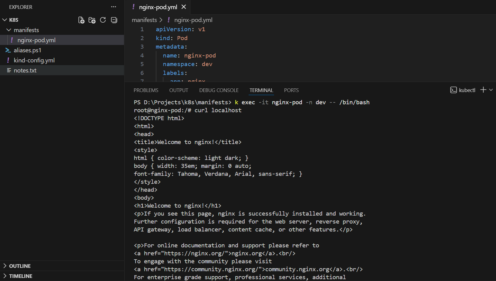
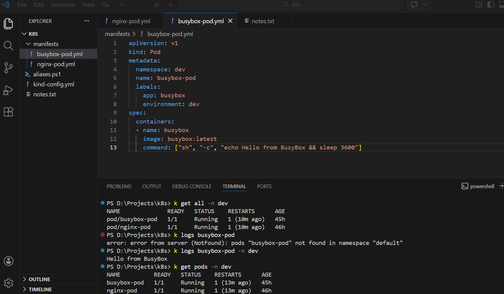
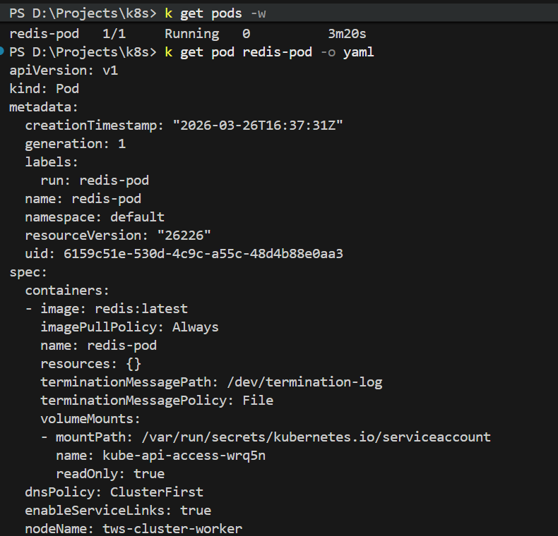
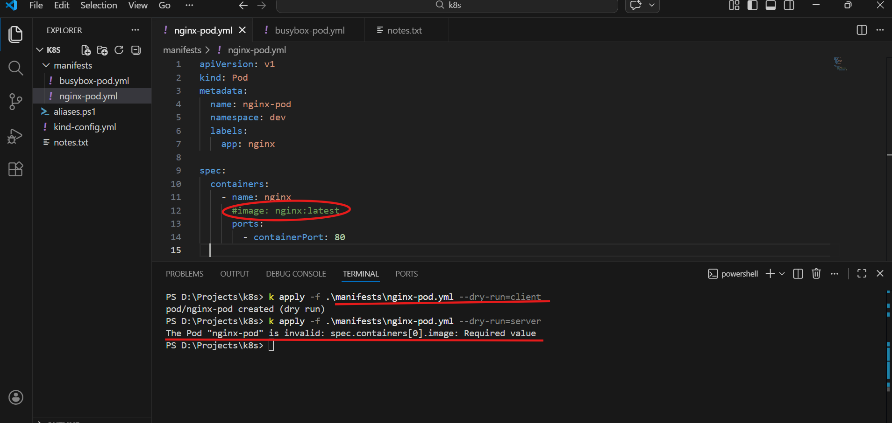
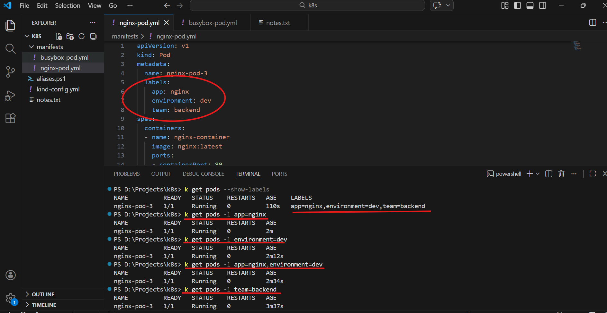

## Challenge Tasks

### Task 1: Create Your First Pod (Nginx)
Create a file called `nginx-pod.yaml`:

```yaml
apiVersion: v1
kind: Pod
metadata:
  name: nginx-pod
  labels:
    app: nginx
spec:
  containers:
  - name: nginx
    image: nginx:latest
    ports:
    - containerPort: 80

    
```

Apply it:
```bash
kubectl apply -f nginx-pod.yaml
```


kubectl get pods
kubectl get pods -o wide

### Detailed info about the pod
kubectl describe pod nginx-pod

### Read the logs
kubectl logs nginx-pod

### Get a shell inside the container
kubectl exec -it nginx-pod -- /bin/bash

### Inside the container, run:
curl localhost:80
exit



---

### Task 2: Create a Custom Pod (BusyBox)
Apply and verify:
```bash
kubectl apply -f busybox-pod.yaml
kubectl get pods -n dev
kubectl logs busybox-pod -n dev
```


---
### Task 3: Imperative vs Declarative
You have been using the declarative approach (writing YAML, then `kubectl apply`). Kubernetes also supports imperative commands:

```bash
# Create a pod without a YAML file
kubectl run redis-pod --image=redis:latest

# Check it
kubectl get pods
```

Now extract the YAML that Kubernetes generated:
```bash
kubectl get pod redis-pod -o yaml
```



---

### Task 4: Validate Before Applying
Before applying a manifest, you can validate it:

```bash
# Check if the YAML is valid without actually creating the resource
kubectl apply -f nginx-pod.yaml --dry-run=client

# Validate against the cluster's API (server-side validation)
kubectl apply -f nginx-pod.yaml --dry-run=server

```
1. Client-side dry run
k apply -f .\manifests\nginx-pod.yml --dry-run=client

👉 What it does:

Validates YAML locally
Does NOT contact the cluster
Checks syntax only

✔ Output:

pod/nginx-pod created (dry run)
2. Server-side dry run
k apply -f .\manifests\nginx-pod.yml --dry-run=server

👉 What it does:

Sends request to Kubernetes API
Validates against:
API schema
Admission controllers
Cluster rules

✔ Output:

pod/nginx-pod created (server dry run)
🔥 Key Difference (Important for interviews)
Type	Checks	Uses Cluster?	Use Case
client	YAML syntax	❌ No	Quick validation
server	Full validation	✅ Yes	Real-world testing

Now intentionally break your YAML (remove the `image` field or add an invalid field) and run dry-run again. See what error you get.

**Verify:** What error does Kubernetes give when the image field is missing?



---
### Task 5: Pod Labels and Filtering
Labels are how Kubernetes organizes and selects resources. You added labels in your manifests — now use them:

```bash
# List all pods with their labels
kubectl get pods --show-labels

# Filter pods by label
kubectl get pods -l app=nginx
kubectl get pods -l environment=dev

# Add a label to an existing pod
kubectl label pod nginx-pod environment=production

# Verify
kubectl get pods --show-labels

# Remove a label
kubectl label pod nginx-pod environment-
```

Write a manifest for a third pod with at least 3 labels (app, environment, team). Apply it and practice filtering.


---


### Task 6: Clean Up
Delete all the pods you created:

```bash
# Delete by name
kubectl delete pod nginx-pod
kubectl delete pod busybox-pod
kubectl delete pod redis-pod

# Or delete using the manifest file
kubectl delete -f nginx-pod.yaml

# Verify everything is gone
kubectl get pods
```

Notice that when you delete a standalone Pod, it is gone forever. There is no controller to recreate it. This is why in production you use Deployments (coming on Day 52) instead of bare Pods.

---

## Hints
- `kubectl apply -f` creates or updates a resource from a file
- `kubectl get pods -o wide` shows the node and IP address
- `kubectl describe pod <name>` shows events — very useful for debugging
- `kubectl logs <name>` shows container stdout/stderr
- `kubectl exec -it <name> -- /bin/sh` gives you a shell (use `/bin/sh` if `/bin/bash` is not available)
- Labels are just key-value pairs — they have no meaning to Kubernetes itself, only to selectors
- `--dry-run=client -o yaml` is your best friend for generating manifest templates

---